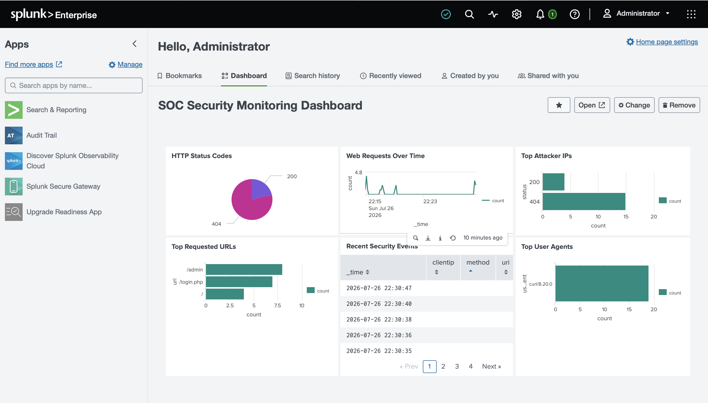

## Sentinel SOC Dashboard
A Security Operations Center monitoring dashboard built with Splunk, Node.js and React for detecting and visualizing security events.

## Features
✔ Centralized log collection
✔ SSH brute force detection
✔ Web attack monitoring
✔ HTTP traffic analysis
✔ Attacker IP identification
✔ Security event visualization
✔ MITRE ATT&CK mapping
✔ Incident reporting

## Technologies
SIEM:
- Splunk Enterprise

Backend:
- Node.js
- Express

Frontend:
- React
- Tailwind CSS
- Recharts

OS:
- Rocky Linux
- Kali Linux
- macOS

  ## Dashboard Preview

## Incident Example
Incident:
SSH Brute Force Attack

Detection:
Splunk Alert

Source:
192.168.64.12

Attempts:
31 failed login attempts

MITRE:
T1110 - Brute Force

Response:
- Investigated logs
- Identified source IP
- Blocked suspicious activity
